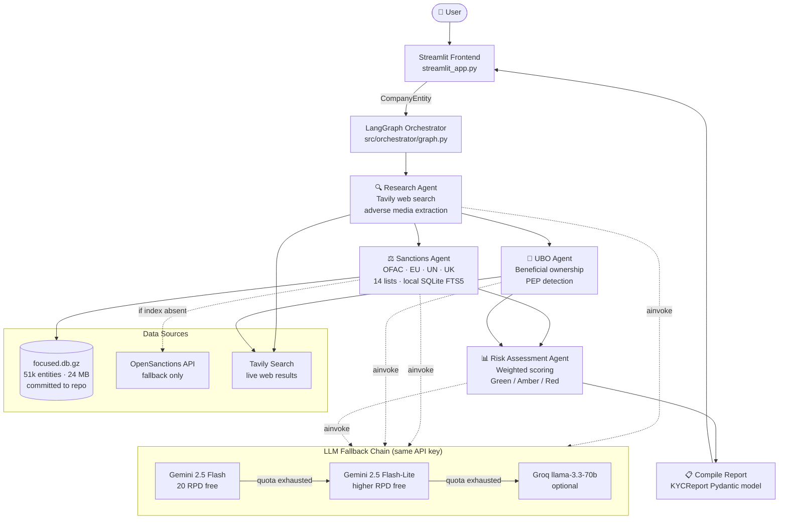

# KYC Screener

[](https://www.python.org/)
[](LICENSE)
[](https://github.com/langchain-ai/langgraph)
[](https://streamlit.io/)
[](https://ai.google.dev/)
[](https://kyc-screener.streamlit.app/)

> **Multi-agent KYC intelligence platform.** Screen any company against 14 global sanctions lists, map beneficial ownership, and produce an AI-powered risk rating — in under 60 seconds.


---

## ✨ Features

| Feature | Details |
|---|---|
| **4 parallel AI agents** | Research, Sanctions, UBO mapping, Risk Assessment |
| **14 sanctions lists** | OFAC SDN/Cons, EU FSF, UN SC, UK HMT, SECO, Interpol + more |
| **Local sanctions index** | 51k entities in a 24 MB committed SQLite DB — no API calls needed |
| **Three-tier LLM fallback** | Gemini 2.5 Flash → Gemini 2.5 Flash-Lite → Groq (optional) |
| **Structured AI outputs** | Pydantic v2 models, never free-text parsing |
| **PDF export** | One-click report download |
| **Demo mode** | Pre-loaded scenarios — works with zero API keys |
| **Streamlit Cloud ready** | Single-file deployment, secrets via Streamlit dashboard |

---

## Architecture



---

## Tech Stack

| Layer | Technology |
|---|---|
| **Orchestration** | [LangGraph](https://github.com/langchain-ai/langgraph) — stateful multi-agent graph |
| **LLM** | Google Gemini 2.5 Flash via `langchain-google-genai` |
| **Web Search** | [Tavily](https://tavily.com/) — research-grade search API |
| **Sanctions Data** | [OpenSanctions](https://www.opensanctions.org/) FTM dataset (local SQLite index) |
| **Frontend** | [Streamlit](https://streamlit.io/) |
| **Data Models** | [Pydantic v2](https://docs.pydantic.dev/) — structured, validated throughout |
| **PDF Export** | [fpdf2](https://pyfpdf.github.io/fpdf2/) |
| **Logging** | [structlog](https://www.structlog.org/) |

---

## Project Structure

```
kyc-screener/
├── streamlit_app.py          # Streamlit Cloud entry point (demo + live modes)
├── src/
│   ├── agents/
│   │   ├── _llm.py           # Three-tier LLM fallback chain
│   │   ├── research.py       # Web search + adverse media extraction
│   │   ├── sanctions.py      # Sanctions list matching
│   │   ├── ubo.py            # Beneficial ownership + PEP detection
│   │   └── risk_assessment.py# Weighted risk scoring
│   ├── orchestrator/
│   │   ├── graph.py          # LangGraph pipeline definition
│   │   └── state.py          # GraphState TypedDict
│   ├── models/               # Pydantic data models (single source of truth)
│   └── tools/
│       ├── search.py         # Tavily web search wrapper
│       ├── sanctions_api.py  # OpenSanctions API / local index router
│       ├── sanctions_local.py# SQLite FTS5 search + Jaccard scoring
│       └── company_registry.py # Company registry lookups
├── data/sanctions/
│   └── focused.db.gz         # Committed 24 MB sanctions index (51k entities)
├── scripts/
│   ├── build_sanctions_index.py        # Build full 1.3M-entity index (local only)
│   └── build_focused_sanctions_index.py# Build & compress the committed index
├── frontend/
│   └── app.py                # Alternative frontend for local FastAPI-backed dev
├── tests/                    # pytest test suite
├── .streamlit/
│   ├── config.toml           # Dark theme + server settings
│   └── secrets.toml.example  # Secret keys template
└── requirements.txt
```

---

## Quick Start

### Prerequisites

- Python 3.11+
- A [Google AI Studio](https://aistudio.google.com/) API key (free tier: 20 req/day on Gemini 2.5 Flash)
- A [Tavily](https://app.tavily.com/) API key (free tier available)

### 1. Clone and install

```bash
git clone https://github.com/singhsudhir/kyc-screener.git
cd kyc-screener
python -m venv venv && source venv/bin/activate
pip install -r requirements.txt
```

### 2. Configure environment

```bash
cp .env.example .env
# Edit .env and fill in your API keys
```

### 3. Run

```bash
# Streamlit app (recommended)
streamlit run streamlit_app.py

# Or the FastAPI backend + Streamlit frontend (local dev)
uvicorn src.api.main:app --reload &
streamlit run frontend/app.py
```

Open [http://localhost:8501](http://localhost:8501). Toggle **Live Screening** in the sidebar to screen any company, or explore the pre-loaded demo scenarios without any API keys.

---

## Environment Variables

| Variable | Required | Description |
|---|---|---|
| `GEMINI_API_KEY` | ✅ Live mode | Google AI Studio API key |
| `TAVILY_API_KEY` | ✅ Live mode | Tavily search API key |
| `GROQ_API_KEY` | Optional | Fallback LLM when all Gemini quotas exhausted |
| `OPENSANCTIONS_API_KEY` | Optional | Live OpenSanctions API (local index used by default) |

See `.env.example` for the full template.

---

## Deploying to Streamlit Cloud

1. Fork this repo
2. Go to [share.streamlit.io](https://share.streamlit.io) → **New app**
3. Set **Main file path** to `streamlit_app.py`
4. Under **Advanced settings → Secrets**, add:

```toml
GEMINI_API_KEY   = "your_key"
TAVILY_API_KEY   = "your_key"
GROQ_API_KEY     = "your_key"   # optional but recommended
```

5. Click **Deploy** — the app auto-decompresses `focused.db.gz` on first run (no setup needed).

The committed `data/sanctions/focused.db.gz` (24 MB) contains 51,229 sanctioned entities across 14 lists and works with zero API calls for sanctions screening.

---

## How It Works

### Agent Pipeline

```
Input: { name, jurisdiction }
         │
         ▼
   ┌─────────────┐
   │  Research   │  Tavily web search · adverse media · public records
   └──────┬──────┘
          │ (parallel fan-out)
    ┌─────┴─────┐
    ▼           ▼
┌────────┐  ┌─────┐
│Sanction│  │ UBO │  Local SQLite FTS5 · Jaccard scoring · PEP detection
└────┬───┘  └──┬──┘
     └────┬────┘
          ▼
   ┌──────────────┐
   │    Risk      │  Weighted: Sanctions > PEP > Adverse Media > Jurisdiction
   │  Assessment  │  → Green (0–33) · Amber (34–66) · Red (67–100)
   └──────┬───────┘
          ▼
   ┌──────────────┐
   │   KYCReport  │  Pydantic model → Streamlit render + PDF export
   └──────────────┘
```

### Sanctions Index

The committed `data/sanctions/focused.db.gz` is built from the [OpenSanctions](https://www.opensanctions.org/) FTM dataset filtered to 14 high-authority lists. Search uses SQLite FTS5 with `unicode61` tokenisation (handles diacritics and multilingual names) plus Jaccard token-overlap scoring.

To rebuild the index from a fresh FTM download:

```bash
# Download the full dataset (~2.6 GB)
curl -o data/sanctions/sanctions.json \
  https://data.opensanctions.org/datasets/latest/default/entities.ftm.json

# Build the focused index and compress
python scripts/build_focused_sanctions_index.py
```

### LLM Fallback Chain

Every agent call goes through a three-tier chain (no extra keys required for tiers 1–2):

| Tier | Model | Free quota |
|---|---|---|
| 1 | `gemini-2.5-flash` | 20 req/day |
| 2 | `gemini-2.5-flash-lite` | Higher RPD |
| 3 | Groq `llama-3.3-70b-versatile` | Requires `GROQ_API_KEY` |

On transient errors (503, per-minute 429) the current tier retries with exponential backoff. On daily quota exhaustion it cascades to the next tier automatically.

---

## Running Tests

```bash
pytest tests/ -v
```

All tests use mocked external APIs — no live calls, no API keys required.

---

## Contributing

1. Fork the repo and create a feature branch
2. Follow the conventions in [CLAUDE.md](CLAUDE.md)
3. Ensure `pytest tests/` passes
4. Open a pull request

---

## License

[MIT](LICENSE) © 2025 Sudhir Singh
